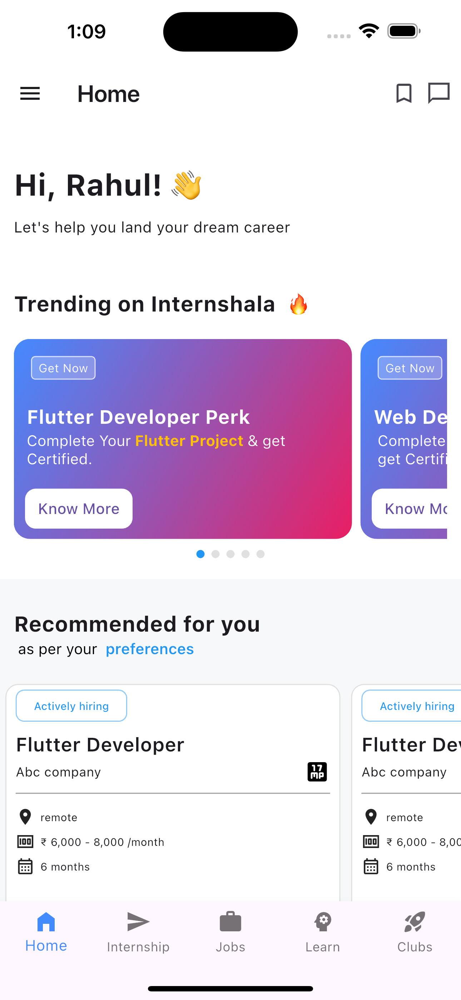
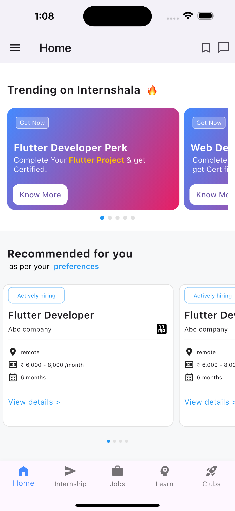

# Internshala Clone 📱

A modern **Internshala-inspired Flutter UI Clone** built to practice real-world mobile app UI development using **Flutter** and **Dart**.

This project focuses on recreating the clean UI, smooth scrolling cards, onboarding feel, and modern mobile experience inspired by the Internshala app.

## ✨ Features

* 🎯 Clean and responsive UI
* 🔥 Trending Internship Carousel
* 💼 Recommended Internship Cards
* 🧭 Bottom Navigation Bar
* 🎨 Smooth animations and page indicators
* 📱 Responsive design for different screen sizes
* 🧩 Reusable widgets architecture

## 🛠️ Tech Stack

* **Flutter**
* **Dart**
* **Material Design**

## 📂 Project Structure

```txt
lib/
│── screens/
│   └── homescreen.dart
│
│── widgets/
│   ├── cards.dart
│   └── universalcard_widget.dart
│
└── main.dart
```

## 📸 Screenshots

> Add screenshots here after uploading them to your repo.

```md



```

## 🚀 Getting Started

### Clone the repository

```bash
git clone https://github.com/rahulkumarsah1999/internshala-ui-clone.git
```

### Navigate to project folder

```bash
cd YOUR_PROJECT_NAME
```

### Install dependencies

```bash
flutter pub get
```

### Run the app

```bash
flutter run
```

## 🎯 Learning Goals

This project was built to:

* Improve Flutter UI skills
* Learn reusable widget design
* Practice real-world app cloning
* Understand page view, indicators, and responsive layouts

## 👨‍💻 Author

**Rahul Kumar Sah**

Flutter Developer | Dart | UI/UX Enthusiast

* GitHub: `rahulkumarsah1999`

## ⭐ Support

If you like this project, consider giving it a **star ⭐** on GitHub.
